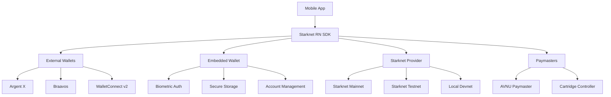

# Starknet React Native SDK

Build **consumer-grade mobile dApps** on Starknet with React Native.

## 🚀 What is the Starknet React Native SDK?

The Starknet React Native SDK is a comprehensive software development kit that enables developers to build consumer-grade mobile applications on Starknet with React Native. By leveraging Starknet's native account abstraction capabilities, this SDK provides simple, high-level tools so that mobile app developers – even those with minimal Web3 experience – can integrate Starknet features into their iOS and Android apps.

## ✨ Key Features

### 🔗 **Multi-Platform Support**
- **iOS and Android Compatible** - Works seamlessly on both platforms via React Native
- **Native Module Integration** - Interfaces with device capabilities like biometrics and secure storage
- **Optimized Performance** - Designed specifically for mobile environments

### 💼 **Wallet Integration**
- **External Wallet Support** - Seamless integration with Argent X, Braavos, and more via WalletConnect v2
- **Embeddable In-App Wallet** - Built-in wallet with biometric security (Phase 2)
- **Unified API** - Common interface across all wallet types

### 🔐 **Enhanced Security**
- **Biometric Authentication** - FaceID/TouchID integration for transaction signing
- **Secure Key Storage** - iOS Keychain and Android Keystore integration
- **Account Abstraction** - Leverages Starknet's native account abstraction features

### ⚡ **Advanced Features**
- **Gasless Transactions** - Paymaster support via AVNU and Cartridge
- **Session Keys** - Temporary keys for improved UX
- **Multi-call Transactions** - Batch multiple operations in one transaction

### 🧰 **Developer Experience**
- **TypeScript First** - Fully typed with comprehensive type definitions
- **React Hooks** - Familiar patterns for React Native developers
- **Comprehensive Testing** - Extensive test coverage and examples
- **Rich Documentation** - Detailed guides, API reference, and examples

## 🏗️ Architecture Overview



## 🎯 Development Phases

The SDK is developed in phases to ensure quality and incremental value delivery:

### ✅ **Phase 1: MVP - Core Wallet Connectivity** (Current)
- Basic wallet connectors for external wallets
- Starknet provider and network configuration
- Error handling and validation utilities
- TypeScript type definitions

### 🚧 **Phase 2: Embedded Wallet & Biometric Auth**
- In-app wallet creation and management
- Biometric authentication integration
- Secure key storage implementation
- React Native UI components

### 🚧 **Phase 3: Paymaster Integration & Advanced Features**
- AVNU paymaster support
- Cartridge Controller integration
- Session key functionality
- Multi-call transaction batching

### 🚧 **Phase 4: Polish & Community Launch**
- Complete documentation
- Example applications
- Performance optimization
- Security audits

## 📦 Quick Start

Get started with the Starknet React Native SDK in just a few steps:

```bash
npm install @starknet/react-native-sdk
# or
yarn add @starknet/react-native-sdk
```

```typescript
import {
  createProvider,
  getDefaultConnectors,
  StarknetNetwork
} from '@starknet/react-native-sdk'

// Create a provider
const provider = createProvider({
  networkId: StarknetNetwork.TESTNET,
  chainId: '0x534e5f5345504f4c4941'
})

// Get available wallet connectors
const connectors = getDefaultConnectors()
```

👉 **[Continue to Installation Guide →](./getting-started/installation)**

## 🤝 Contributing

We welcome contributions from the community! Whether you're fixing bugs, adding features, improving documentation, or spreading the word, your help is appreciated.

- 📖 **[Contributing Guide](./contributing/overview)** - Learn how to contribute
- 🐛 **[Report Issues](https://github.com/keep-starknet-strange/starknet-react-native-sdk/issues)** - Found a bug? Let us know
- 💬 **[Join Discord](https://discord.gg/starknet)** - Get help and discuss with the community

## 📄 License

This project is licensed under the MIT License - see the [LICENSE](https://github.com/keep-starknet-strange/starknet-react-native-sdk/blob/main/LICENSE) file for details.

---

**Ready to build the future of mobile dApps on Starknet?** 🚀 